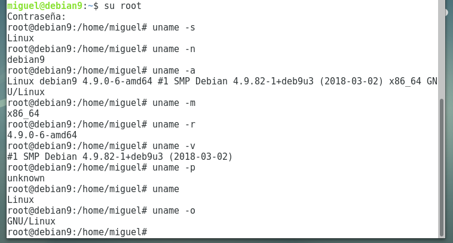

### EXAMEN 1  
**Nombre:** Miguel Andrés Isaza Barona  
**Código:** A00054628  
**Materia:** Sistemas operacionales  
**Correo personal:** miguel11andres@hotmail.com  

### 3 Validación de la imagen  
Primero descargamos la imagen debian 9 de https://www.debian.org/distrib/netinst#smallcd seleccionamos amd64, luego de
http://cdimage.debian.org/debian-cd/current/amd64/iso-cd/MD5SUMS consultamos el valor del checksum de la imagen, descargamos un software 
que nos permite comprobar que el checksum de la imagen sea igual al consultado, esta herramienta se descargó de
http://download.cnet.com/MD5-SHA-Checksum-Utility/3001-2092_4-10911445.html, efectivamente se pudo comprobrar que los checksum son iguales, esto se muestra en la siguiente imagen:
                                              

### 4 Instalación  
-Primero abrimos virtualbox, luego de esto damos nueva para cear una nueva máquina, le damos un nombre (en mi caso es Debian9),
seleccionamos el tipo (Linux) y la versión de la máquina virtual (Debian 64 bits).  
-Luego se configuran los recursos necesarios para la máquina (memoria RAM y disco duro).  
-Luego nos vamos a configuración, en almacenamiento montamos la imagen, y en la parte de red habilitamos 2 adaptadores (el nat
y el adaptador puente).  
-Luego le damos iniciar, una vez hecho esto la máquina se reiniciará y ejecutará la imagen de debian9, despúes se mostrará una ventana donde nos muestra la opción de instalar el sistema operativo, seleccionamos la opción que dice graphical install, seleccionamos el idioma, el idioma del teclado, luego creamos un superusuario, le damos un nombre de usuario y una contraseña, a partír de ahí se da continuar para la instalación.  

**Información del SO:**  
                                     

### 5 Configuración putty
Para poder conectarse con la máquina por medio de putty, primero la máquina virtual debe tener conexión a internet (este paso se ha hecho previamente al momento de instalar la máquina virtual, en la configuración de la máquina virtual se ha habilitado un adaptador puente, en mi caso le dí la opción de que permitiera crear conexiónes de red de área local inalámbrica) luego de esto abrimos putty, le damos la ip de la máquina, seleccionamos ssh, en puerto ponemos el 22 y finalmente damos aceptar e iniciamos la conexión, si la conexión no se pudo hacer, se debe ejecutar el siquiente comando en la máquina virtual para corregir este error:
```apt-get install openssh-server```  

Una vez hecho esto se puede dar paso a la conexión sin problemas:  
  
  

### 6 Instalación git y tig:
Primero nos cambiamos al usuario root, despúes ejecutamos los siguientes comandos para la instalación del tig:  
  

Historial de los commits realizados:  
  

Para la instalación del git, en mi caso ocurrió que cuando ejecuté el comando ```apt-get install git``` me decía que no había nada para instalar:  
  

### 7 Exportación e importación de la máquina virtual  

Para exportar la máquina virtual, en virtual box, en la barra de tareas damos click en archivo y seleccionamos la opción que dice exportar servicio virtualizado, luego seleccionamos la máquina virtual (debian9 en mi caso) y damos continuar, luego aparecerá lo siguiente:  
  
damos click en Next y luego en Exportar, ya sólo queda esperar:  
  

**Importar la máquina virtual:**  
Para importar la máquina virtual, nos vamos a la barra de tareas de virtual box, damos click en importar servicio virtualizado.  

### 8 centos7 vs debian9
                 DEBIAN 9                                                                                 CENTOS 7  
     1- Distribución libre, no está basada en ninguna otra destribución.                          Distribución de GNU/Linux derivado.
     2- Versiones de las principales aplicaciones:                                        Versiones de las principales aplicaciones:  
     Apache ->2.2.15                                                                                      Apache -> 2.2.22  
     PHP -> 5.3.3                                                                                         PHP -> 5.4.4  
     MySQL -> 5.1.66                                                                                      MySQL -> 5.5.30  
     PostgreSQL -> 8.4.13                                                                                 PostgreSQL -> 9.1.9  
     3- Ciclo de vida: 10 años, 5½ años actualizaciones, 1 año mantenimiento                        Ciclo de vida: 	Sin ciclos fijos  
        3½ años parches críticos                                                                  1 año tras siguiente versión estable  
     4- Requerimientos minimos: Intel pentium 1-4 celeron, AMD 32,256,500MB y 4GB           Memoria Ram de 64MB, espacio minimo en disco                                                                                               duro de 1GB.  
     5- Arquitecturas: PowerPC, x86 (64 y 32 bits), ARM, SPARC                                                x86_64
        MIPS, 5390.
     6- Facilidad de configuración: Sin costo, sencillo                                        Tiene configuración por defecto
          multiusuario, kernel.                                                                Tiene programas incluidos, incluye
                                                                                                navegadores web y utilidades de oficina.
