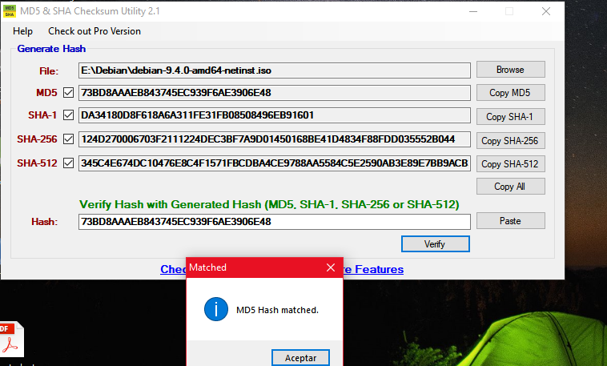
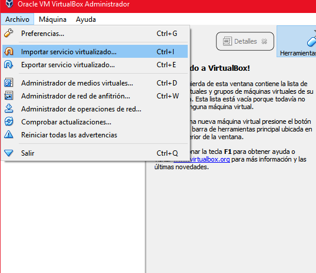
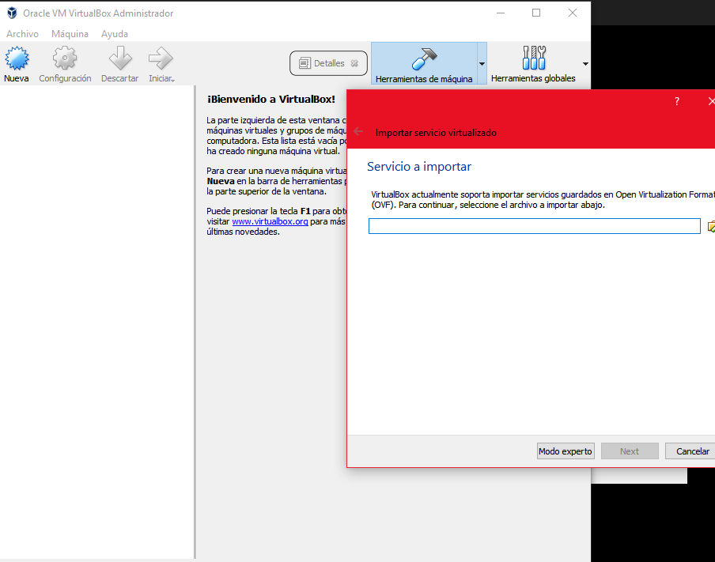
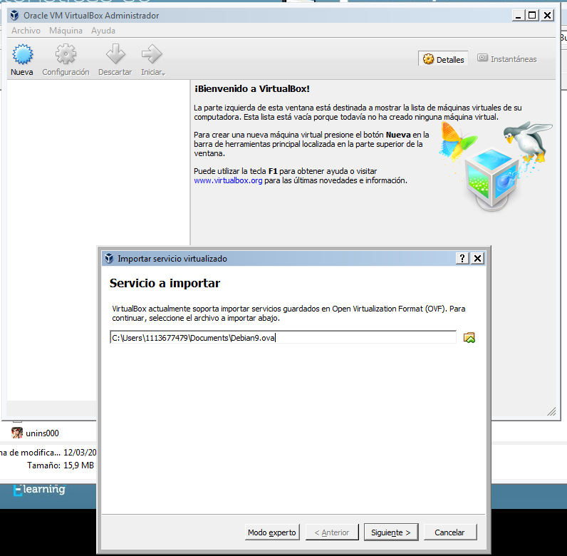
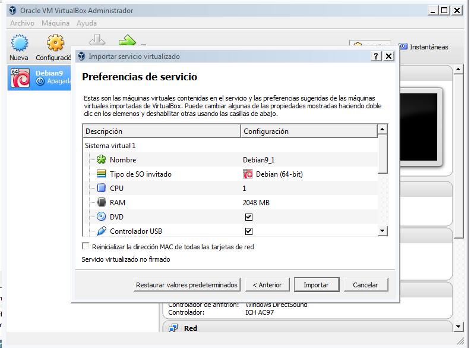
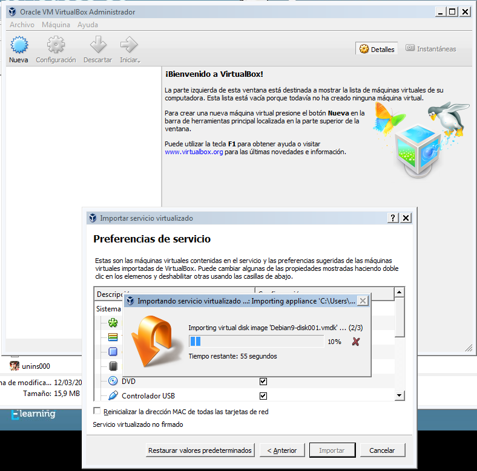
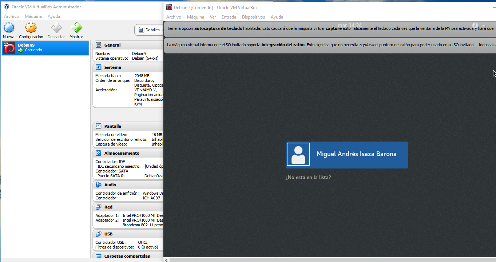

### EXAMEN 1  
**Nombre:** Miguel Andrés Isaza Barona  
**Código:** A00054628  
**Materia:** Sistemas operacionales  
**Correo personal:** miguel11andres@hotmail.com  
**URL repositorio:** https://github.com/DonMiguelin/so-exam1.git 

### 3 Validación de la imagen  
-Primero descargamos la imágen debian 9 de https://www.debian.org/distrib/netinst#smallcd seleccionamos amd64.  
-Luego de http://cdimage.debian.org/debian-cd/current/amd64/iso-cd/MD5SUMS consultamos el valor del checksum del ISO de debian 9.  
-Despúes descargamos un software que nos permite comprobar que el checksum del ISO sea igual al consultado en la url anterior, esta herramienta se descargó de http://download.cnet.com/MD5-SHA-Checksum-Utility/3001-2092_4-10911445.html.  
-Efectivamente se pudo comprobrar que los checksum son iguales, esto se muestra en la siguiente imágen:
                                              

### 4 Instalación  
-Primero abrimos virtualbox, luego de esto damos nueva para cear una nueva máquina virtual, le damos un nombre (en mi caso es Debian9),
seleccionamos el tipo (Linux) y la versión de la máquina virtual (Debian 64 bits).  
-Luego se configuran los recursos necesarios para la máquina (memoria base: 2048MB, Disco duro: 8GB, procesadores, etc).  
-Luego nos vamos a configuración, vamos a la opción almacenamiento y montamos la imagen de debian, y en la parte de red habilitamos 2 adaptadores (el nat y el adaptador puente).  
-Luego le damos iniciar, una vez hecho esto la máquina se reiniciará y ejecutará la imágen de debian9, despúes se mostrará una ventana donde nos muestra la opción de instalar el sistema operativo, seleccionamos la opción que dice graphical install o install (de acuerdo a lo que desee el usuario, en mi caso fue graphical install), seleccionamos el idioma, el idioma del teclado, luego creamos un superusuario y le damos una contraseña, también le damos una contraseña al root, a partír de ahí se da continuar para la instalación, en medio de la instalación salió una opción que decía si se quería hacer el particionado, se debía seleccionar automatico y dar click en continuar.  
-Luego salió otra opción que decía: ¿desea inicializar con otro cd? En este caso se dio click en no, y una última opción que salío fue lo del gestor de paquetes y seleccionamos colombia-debian.uniminuto.edu.  
-Despues se dio click en continuar y esperamos hasta que la instalación terminara.  
-Una vez finalizó la instalación, se reinició la máquina virtual y el sistema operativo debian estaba listo para usarse.  

**Información del SO Debian 9:**  
                                     
 ``~uname -s``: muestra el nombre del núcleo del sistema operativo.  
 ``~uname -n``: muestra el nombre de 'host' del nodo de red.  
 ``~uname -a``: muestra toda la información sobre el sistema operativo.  
 ``~uname -m``: muestra el tipo de arquitectura del procesador.  
 ``~uname -r``: muestra la versión del kernel.  
 ``~uname -v``: muestra la fecha de publicación del kernel.  
 ``~uname -p``: muestra el tipo de procesador (que siempre muestra descnonocido).  
 ``~uname -o``: muestra el sistema operativo.  
 ``~uname``: hace lo mismo que el comando ``uname -s``.  

### 5 Configuración putty
Para poder conectarse con la máquina por medio de putty, primero la máquina virtual debe tener conexión a internet (este paso se ha hecho previamente al momento de instalar la máquina virtual, en la configuración de la máquina virtual se ha habilitado un adaptador puente, en mi caso le dí la opción de que permitiera crear conexiónes de red de área local inalámbrica) luego de esto abrimos putty, le damos la ip que nos muestra la máquina mediante el comando ```~ip a```, seleccionamos ssh, en puerto ponemos el 22 y finalmente damos aceptar e iniciamos la conexión, si la conexión no se pudo hacer, se debe ejecutar el siguiente comando en la máquina virtual para corregir este error:
```~apt-get install openssh-server```  

Una vez hecho esto se puede dar paso a la conexión sin problemas:  
  
  

### 6 Instalación git y tig:
Primero nos cambiamos al usuario root, despúes ejecutamos los siguientes comandos para la instalación del tig:  
  

Historial de los commits realizados (comando usado ```~tig```):  
  

Para la instalación del git, en mi caso ocurrió que cuando ejecuté el comando ```~apt-get install git``` me decía que no había nada para instalar:  
  

### 7 Exportación e importación de la máquina virtual  

Para exportar la máquina virtual, en virtual box, en la barra de tareas damos click en archivo y seleccionamos la opción que dice exportar servicio virtualizado, luego seleccionamos la máquina virtual (debian9 en mi caso) y damos continuar, luego aparecerá lo siguiente:  
  
damos click en Next y luego en Exportar, ya sólo queda esperar:  
  

**Importar la máquina virtual:**  
Para importar la máquina virtual, nos vamos a la barra de tareas de virtual box, damos click en importar servicio virtualizado.  
  

Luego nos dirijimos la carpeta donde se encuantra ubicado la máquina y la seleccionamos:  
  
  

Después nos saldrá lo siguiente:  
  

Damos click en importar y luego esperamos a que e importe la máquina:  
  

Luego de lo anterior, la máquina estará lista para usarse:  
  
### 8 centos7 vs debian9
                 DEBIAN 9                                                                                     CENTOS 7  
                 
     1- Distribución libre, no está basada en ninguna otra destribución.                          Distribución de GNU/Linux derivado.  
     
     2- Versiones de las principales aplicaciones: 
     Apache ->2.2.15                                                                                      Apache -> 2.2.22  
     PHP -> 5.3.3                                                                                         PHP -> 5.4.4  
     MySQL -> 5.1.66                                                                                      MySQL -> 5.5.30  
     PostgreSQL -> 8.4.13                                                                                 PostgreSQL -> 9.1.9  
     
     3- Ciclo de vida: 10 años, 5½ años actualizaciones, 1 año mantenimiento                       Ciclo de vida: 	Sin ciclos fijos  
        3½ años parches críticos                                                                   1 año tras siguiente versión estable  
        
     4- Requerimientos minimos: 
        Intel pentium 1-4 celeron, AMD 32,256,500MB y 4GB                                          Memoria Ram de 64MB, espacio minimo  en disco duro de 1GB.  

     5- Arquitecturas:
        PowerPC, x86 (64 y 32 bits), ARM, SPARC                                                               x86_64
        MIPS, 5390.  
        
     6- Facilidad de configuración:
          Sin costo, sencillo                                                                   Tiene configuración por defecto
          multiusuario, kernel.                                                                 Tiene programas incluidos, incluye
                                                                                                navegadores web y utilidades de oficina.  
                                                                                                
     7- Peso de la versión más sencilla:
                 300 MB                                                                                         500MB
                 
     8- Es usada en:
         Se dice que este sistema operativo es para                                               Es muy usado en las empresas
         expertos en linux debido a su complejidad en                                             
         la instalación.
       
     9-  Versión núcleo Kernel:
             kernel: 4.9.0                                                                                   Kernel 3.10.0  
             
     10- Estabilidad:
            Debido a que los desarrolladores detras de                                             CentOS es un clon de una de las
            Debian, se empeñan en probar todo, antes de                                            distribuciones comerciales más
            liberar una nueva versión, esta es junto con                                           estables (Redhat), por lo que no es   
            CentOS una de las más estables distribuciones                                          muy propenso a errores.
            de GNU/Linux disponibles actualmente.  
